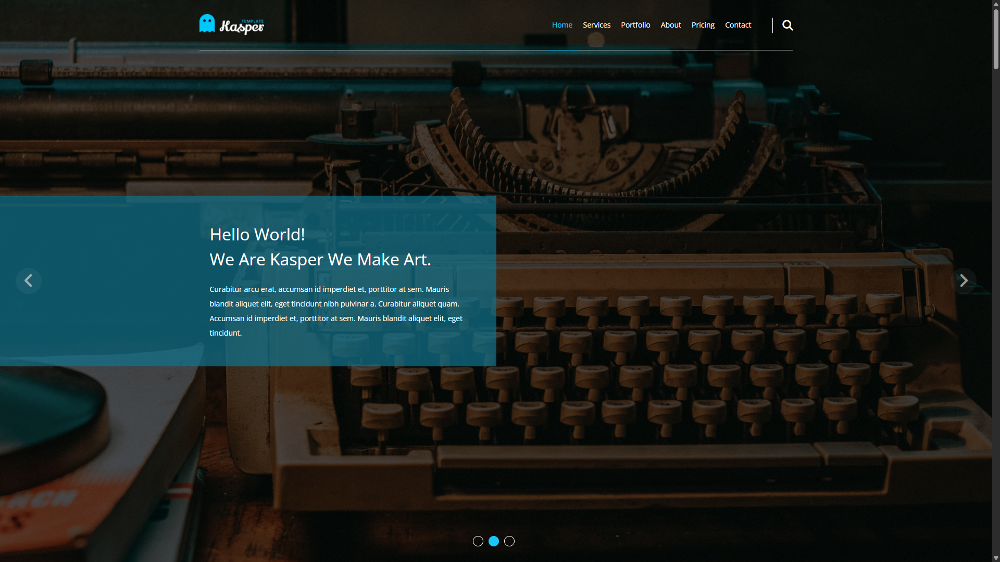

# 🌐 Kasper | Template Two

A modern and elegant website template built using **HTML5** and **CSS3**.  
This is the **second project** in the HTML & CSS learning path, featuring a clean layout, responsive design, and smooth user experience.

---

## 🚀 Live Demo

📍 [View Live](https://abd-el-rahman-adel-dev.github.io/HTML_CSS_Second_Project/)

---

## 📸 Screenshot

<!-- Add screenshots when available -->


---

## ✨ Features

- 🖼️ Fullscreen hero section with background image and overlay
- 🧭 Sticky & transparent navigation bar
- 📦 Services, Portfolio, Testimonials, and Contact sections
- 📱 Responsive layout for all devices
- 🌙 Dark footer with social icons

---

## 🛠 Tech Stack

- **HTML5**
- **CSS3**

> 💡 No frameworks or libraries – pure HTML & CSS

---

## 📦 Getting Started

To run the project locally:

```bash
git clone https://github.com/abd-el-rahman-adel-dev/HTML_CSS_Second_Project.git
cd HTML_CSS_Second_Project
open index.html
```

Or just double-click `index.html` in your file manager.

---

## 📁 Project Structure

```
📦 HTML_CSS_Second_Project
┣ 📂 css
┃ ┗ 📜 kasper.css
┣ 📂 images
┣ 📜 index.html

```

---

## 📄 License

This project is licensed under the [MIT License](./LICENSE).

---

## 🙋‍♂️ Author

- [Abd El-Rahman Adel](https://github.com/abd-el-rahman-adel-dev)
- [LinkedIn](https://www.linkedin.com/in/abdelrahman-adel-webdev)

---

> ⭐ Feel free to fork this repo, give it a star, or reuse the template in your own projects!
